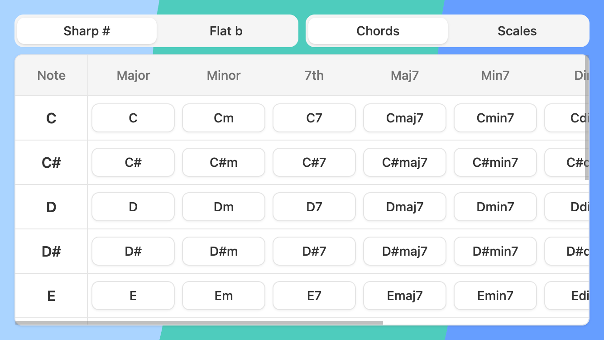
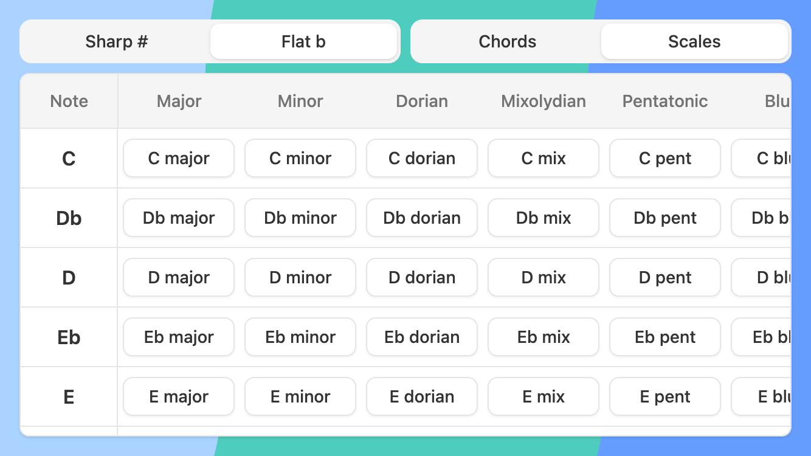
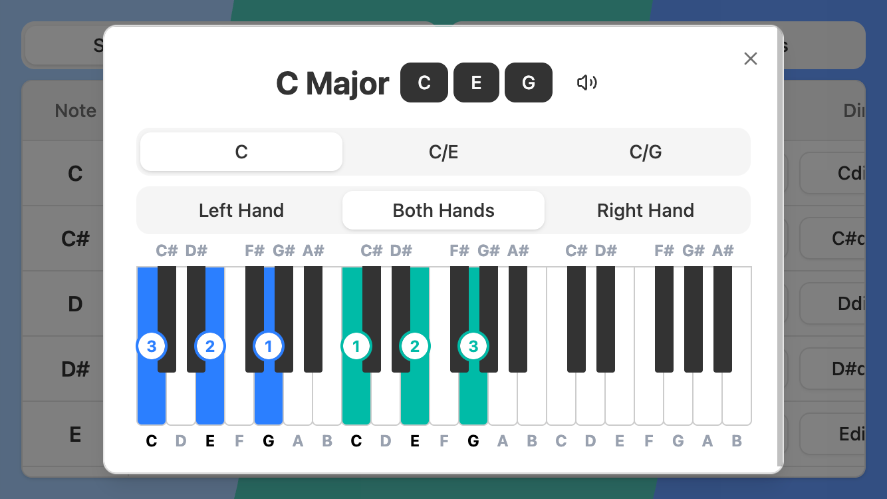
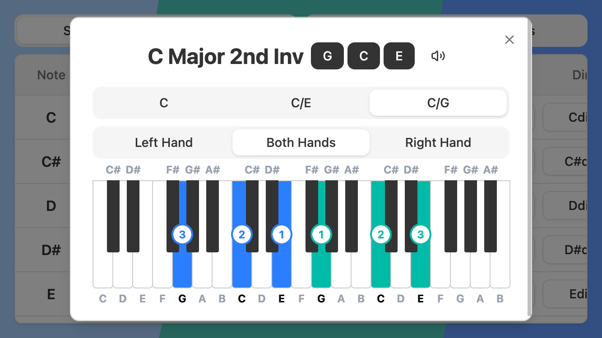

# 🎹 piano-practice

An interactive web app for exploring **musical chords and scales**, built with **React**, **Tailwind CSS**, and **TypeScript**.  
It lets users visualise notes on a piano, switch between sharps and flats, and explore a wide range of chords, inversions, and scales — a perfect reference for learners, musicians, and songwriters.

<!-- Screenshots grid -->

  
  

  
  

## 🚀 Getting started

- Clone the repo: `git clone https://github.com/your-username/piano-trainer.git`
- Cd into the root folder: `cd piano-practice`
- Install dependencies: `npm install`
- Run the dev server: `npm run dev`
- Then open http://localhost:5173 in your browser

## 🎶 Add a new chord

- `CHORD_FORMULAS` is stored in src/data/chords.ts. Define your new chord here, specifying the full name and the intervals between the notes of the chord.
- Your chord now exists, but you need to display it in the MusicTable.tsx component. Go to src/components/tables/useModel.tsx and add your new chord type to the switch statement in the `getItemId` function.

## 🎵 Add a new scale

- `SCALE_FORMULAS` is stored in src/data/scales.ts. Define your new scale here, specifying the full name and the intervals between the notes of the chord.
- Your scale now exists, but you need to display it in the MusicTable.tsx component. Go to src/components/tables/useModel.tsx and add your new scale type to the type map in the `formatScaleLabel` function.

## 🧠 Future Ideas

### 🎯 Testing Mode

Practice recognising chords and scales by name, ear or visual pattern — with timed quizzes and performance tracking.

### 🎵 Songwriting Mode

Experiment with chord progressions, generate ideas in different keys, and export loops or MIDI snippets.

### 🎧 Audio Enhancements

Add richer instrument sounds, sustain pedal effects, and smoother playback transitions.

## 🙏 Credits

All piano note audio samples are sourced from https://github.com/fuhton/piano-mp3
