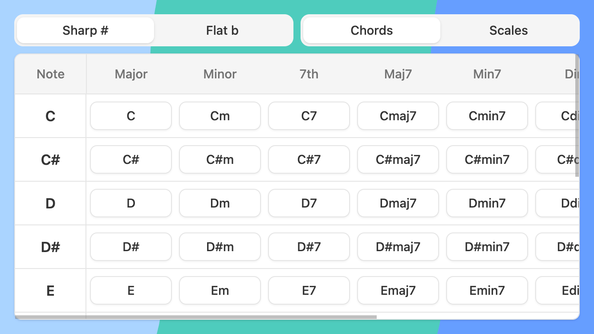
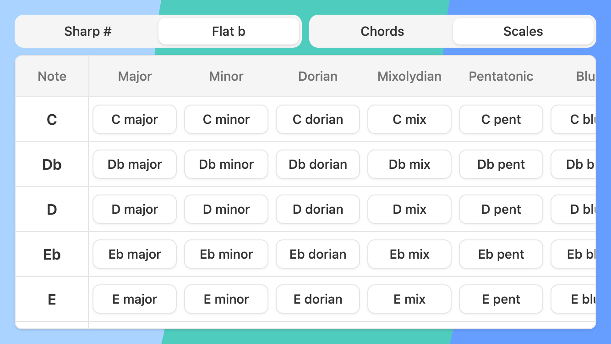
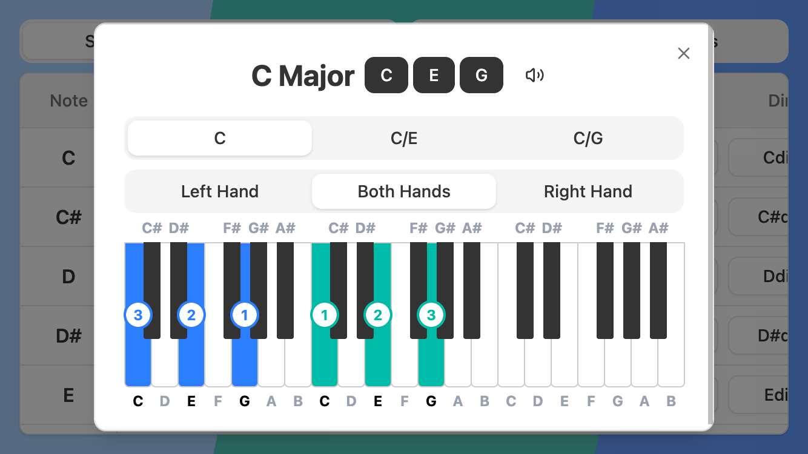
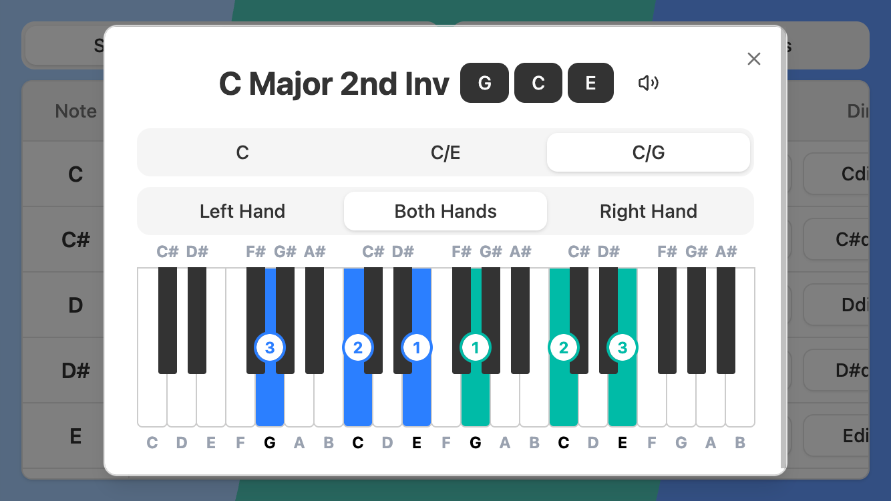

# 🎹 piano-practice

An interactive web app for exploring **musical chords and scales**, built with **React**, **Tailwind CSS**, and **TypeScript**.  
It lets users visualise notes on a piano, switch between sharps and flats, and explore a wide range of chords, inversions, and scales — a perfect reference for learners, musicians, and songwriters.

<!-- Screenshots grid -->

  
  

  
  

## 🚀 Getting started

- Clone the repo: `git clone https://github.com/your-username/piano-trainer.git`
- Cd into the root folder: `cd piano-practice`
- Use Node.js 22 (`nvm use` picks it up from `.nvmrc`)
- Install dependencies: `npm install`
- Run the dev server: `npm run dev`
- Then open http://localhost:5173 in your browser
- Run the unit tests: `npm test`

## 🎓 Practice mode

Click **Practice** to test yourself with flashcards.

- **Set up a test:** choose chords, scales or both (optionally with inversions), then pick items yourself, at random, or least confident first. You can also limit it to items at or below a confidence level. Choose whether cards show the name or the notes, which hands to use, and a number of cards or a time limit.
- **Flashcards:** answer **Yes / Unsure / No** (keys `1` `2` `3`) to reveal the answer and hear it. Change your answer if needed, then press **Next**, `→` or swipe left. `R` replays the sound.
- **Confidence:** every chord, inversion and scale has a score from 0 to 3. Yes adds 1, Unsure keeps it the same, and No takes 1 away. Scores are shown as dots in the table and chord/scale popups, and are saved when a test ends.
- **Your progress** is stored in this browser's localStorage. Use **Export** / **Import** on the setup screen to back it up or move it to another device.

The logic lives in `src/lib/progress.ts` (scoring and storage), `src/lib/practiceDeck.ts` (building the card deck) and `src/data/practiceItems.ts` (stable ids for every chord, inversion and scale). The screens are in `src/components/practice/`.

## 🎶 Add a new chord

- `CHORD_FORMULAS` is stored in src/data/chords.ts. Define your new chord here, specifying the full name and the intervals between the notes of the chord.
- Your chord now exists, but you need to display it in the MusicTable.tsx component. Go to src/components/tables/useModel.tsx and add your new chord type to the switch statement in the `getItemId` function.

## 🎵 Add a new scale

- `SCALE_FORMULAS` is stored in src/data/scales.ts. Define your new scale here, specifying the full name and the intervals between the notes of the chord.
- Your scale now exists, but you need to display it in the MusicTable.tsx component. Go to src/components/tables/useModel.tsx and add your new scale type to the type map in the `formatScaleLabel` function.

## 🧠 Future Ideas

### 🎵 Songwriting Mode

Experiment with chord progressions, generate ideas in different keys, and export loops or MIDI snippets.

### 🎧 Audio Enhancements

Add richer instrument sounds, sustain pedal effects, and smoother playback transitions.

## 🙏 Credits

All piano note audio samples are sourced from https://github.com/fuhton/piano-mp3
